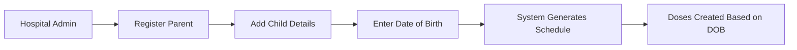
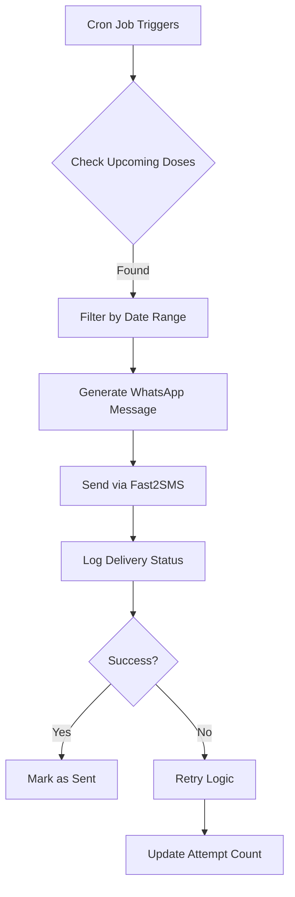
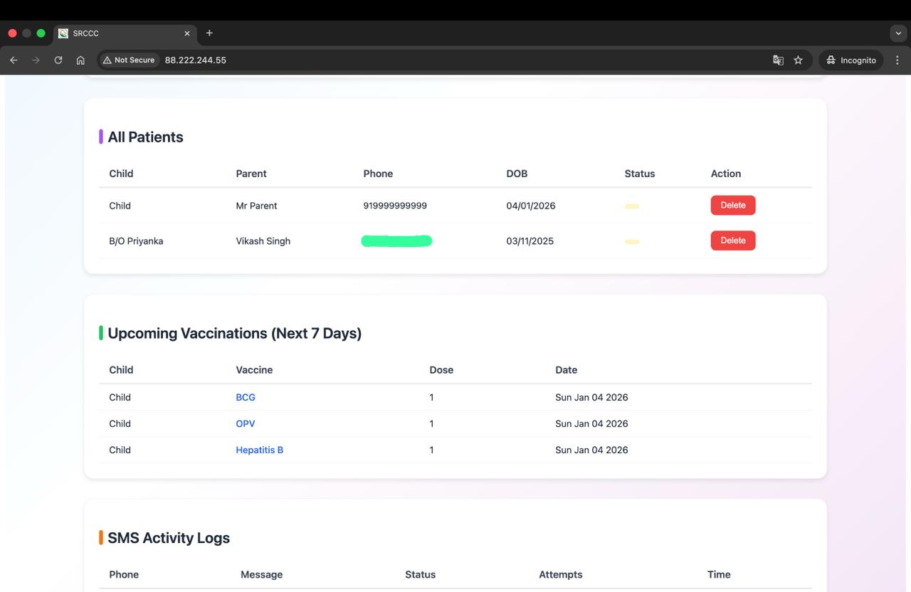
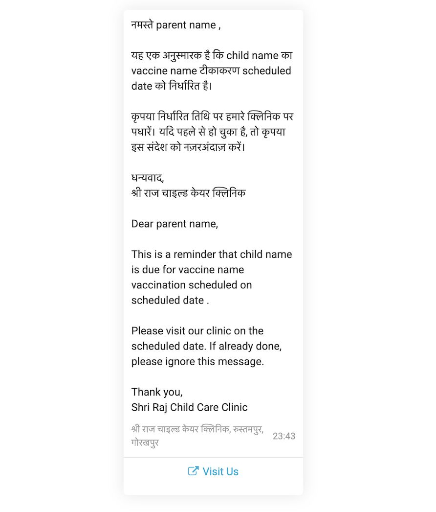

# 💉 Vaccination Reminder Platform

<div align="center">


**A full-stack vaccination reminder system built as a real-world SaaS pilot for hospitals**

Automated WhatsApp reminders • Patient management • Schedule tracking • Message logs

[Features](#-features) • [Tech Stack](#-tech-stack) • [Installation](#-installation) • [Usage](#-usage) • [Roadmap](#-roadmap)

</div>

---

## 📋 Overview

The Vaccination Reminder Platform manages patient vaccination schedules and sends automated WhatsApp reminders using MSG91/Fast2SMS. This repository represents a **proof-of-concept** deployed and tested on a live VPS, customized for single-hospital use.

🌐 **Live Pilot**: [http://88.222.244.55/](http://88.222.244.55/)
(Sample Login ID Password to be updated soon)

### Key Highlights

- ✅ JWT-based secure authentication
- ✅ Automated WhatsApp notifications
- ✅ Real-time vaccination schedule tracking
- ✅ Production-ready deployment (Nginx + PM2)
- ✅ Comprehensive message logging

---

## 💡 Motivation

### The Problem

Parents often forget their child's vaccination dates, leading to missed immunizations and potential health complications. No reminder systems exist, putting children's health at risk.

**Key challenges identified:**
- 📅 Parents struggle to track multiple vaccination dates
- 📱 No automated reminder system in clinics and hospitals
- 💰 High infrastructure costs (VPS hosting, WhatsApp API, DLT verification, SMS rates)
- 🏥 Hospitals lack a centralized patient management system

### The Solution: VReminder

VReminder bridges this gap by sending **automated WhatsApp reminders** at strategic intervals:
- **7 days before** the scheduled date
- **3 days before** the scheduled date  
- **On the vaccination day**

### Business Model: Win-Win Partnership

Instead of bearing the entire cost ourselves, we partnered with **hospitals and clinics** who benefit from:

✅ **Brand Visibility** - Messages are sent from the hospital's number, subtly advertising their services  
✅ **Patient Retention** - Automated reminders improve patient compliance and satisfaction  
✅ **Reminders for the Parents** - Sent thrice, reminding them about the due date and vaccine name
✅ **No Additional Effort** - The system runs in the background, requiring minimal intervention  

This approach helps us **offset messaging and hosting costs** while providing immense value to both parents and healthcare providers.

### Current Status

🚀 **Pilot Program**: Currently running with **1 hospital** to validate the workflow, gather feedback, and refine the system before scaling to multiple healthcare facilities.

---

## ✨ Features

<table>
<tr>
<td width="50%">

### Admin Features
- 🔐 Secure authentication system
- 👥 Patient & child registration
- 📅 Vaccine schedule generation
- 📊 Dashboard with upcoming vaccinations
- 📝 Message logs with status tracking

</td>
<td width="50%">

### Automation
- 🤖 Background reminder jobs
- ⏰ Cron-ready scheduling
- 📱 WhatsApp template messages
- 🔄 Retry mechanism for failed sends
- 📈 Delivery status tracking

</td>
</tr>
</table>

---

## 🛠 Tech Stack

### Backend
```
Node.js + Express
MySQL Database
JWT Authentication
PM2 Process Manager
```

### Frontend
```
React (Vite)
Axios HTTP Client
Responsive Admin UI
```

### Messaging
```
WhatsApp via Fast2SMS/MSG91
Template-based messaging
Delivery confirmation
```

---

## 📁 Repository Structure

```
vaccination-reminder-platform/
│
├── backend/
│   ├── src/
│   │   ├── routes/          # API endpoints
│   │   ├── jobs/            # Background jobs
│   │   ├── services/        # Business logic
│   │   ├── middleware/      # Auth & validation
│   │   └── app.js          # Entry point
│   ├── .env.example
│   └── package.json
│
└── frontend/
    └── admin-ui/
        ├── src/
        │   ├── components/  # React components
        │   ├── pages/       # Page views
        │   └── services/    # API calls
        ├── dist/            # Build output
        └── package.json
```

---

## 🚀 Installation

### Prerequisites

- Node.js v18+
- MySQL v8+
- Fast2SMS/MSG91 account
- Git

### 1️⃣ Database Setup

Create the database:

```sql
CREATE DATABASE vacc_reminder;
```

Run the schema script:

```sql
-- Create tables (see Database Schema section below)
```

Seed vaccine data:

```sql
INSERT INTO vaccines (id, name) VALUES
(1, 'BCG'), (2, 'OPV'), (3, 'Hepatitis B'),
(4, 'DTwP/DTaP'), (5, 'IPV'), (6, 'Hib'),
(7, 'PCV'), (8, 'Rotavirus'), (9, 'Influenza'),
(10, 'Typhoid Conjugate'), (11, 'MMR'),
(12, 'Meningococcal'), (13, 'Hepatitis A'),
(14, 'Japanese Encephalitis'), (15, 'Varicella'),
(16, 'Tdap'), (17, 'HPV')
ON DUPLICATE KEY UPDATE name = VALUES(name);
```

### 2️⃣ Backend Setup

```bash
cd backend
npm install
```

Create `.env` file:

```env
PORT=4000

# Database
DB_HOST=localhost
DB_USER=vreminder
DB_PASSWORD=your_secure_password
DB_NAME=vacc_reminder

# Authentication
JWT_SECRET=your_jwt_secret_key_min_32_chars

# Messaging Service
MSG91_AUTHKEY=your_msg91_authkey
MSG91_WHATSAPP_NUMBER=91xxxxxxxxxx
MSG91_NAMESPACE=your_namespace

FAST2SMS_API_KEY=your api key
FAST2SMS_MESSAGE_ID=9844
FAST2SMS_PHONE_NUMBER_ID=91xxxxxxxxxx
```

Start the server:

```bash
# Development
node src/app.js

# Production
pm2 start src/app.js --name vacc-backend
pm2 save
pm2 startup
```

### 3️⃣ Frontend Setup

```bash
cd frontend/admin-ui
npm install
```

Create `.env.production`:

```env
VITE_API_BASE_URL=http://YOUR_SERVER_IP:4000/api
```

Build and deploy:

```bash
npm run build

# Deploy to server
scp -r dist/* root@SERVER_IP:/var/www/vreminder/
```

---

## 📊 Database Schema

<details>
<summary>Click to expand full schema</summary>

### Hospitals Table
```sql
CREATE TABLE hospitals (
  id INT AUTO_INCREMENT PRIMARY KEY,
  name VARCHAR(255) NOT NULL,
  api_key VARCHAR(255),
  created_at TIMESTAMP DEFAULT CURRENT_TIMESTAMP
);
```

### Admins Table
```sql
CREATE TABLE admins (
  id INT AUTO_INCREMENT PRIMARY KEY,
  hospital_id INT NOT NULL,
  email VARCHAR(255) UNIQUE NOT NULL,
  password_hash VARCHAR(255) NOT NULL,
  name VARCHAR(255),
  role ENUM('admin','operator') DEFAULT 'operator',
  created_at TIMESTAMP DEFAULT CURRENT_TIMESTAMP,
  FOREIGN KEY (hospital_id) REFERENCES hospitals(id) ON DELETE CASCADE
);
```

### Patients Table
```sql
CREATE TABLE patients (
  id INT AUTO_INCREMENT PRIMARY KEY,
  hospital_id INT NOT NULL,
  parent_name VARCHAR(255) NOT NULL,
  parent_phone VARCHAR(20) NOT NULL,
  parent_email VARCHAR(255),
  child_name VARCHAR(255),
  child_dob DATE,
  child_id VARCHAR(100),
  consent_optin TINYINT(1) DEFAULT 1,
  created_at TIMESTAMP DEFAULT CURRENT_TIMESTAMP,
  INDEX(parent_phone),
  FOREIGN KEY (hospital_id) REFERENCES hospitals(id) ON DELETE CASCADE
);
```

### Vaccines Table
```sql
CREATE TABLE vaccines (
  id INT AUTO_INCREMENT PRIMARY KEY,
  name VARCHAR(255) NOT NULL,
  description TEXT,
  created_at TIMESTAMP DEFAULT CURRENT_TIMESTAMP
);
```

### Vaccine Schedules Table
```sql
CREATE TABLE vaccine_schedules (
  id INT AUTO_INCREMENT PRIMARY KEY,
  vaccine_id INT NOT NULL,
  name VARCHAR(255),
  recommended_age_days INT,
  dose_number INT DEFAULT 1,
  created_at TIMESTAMP DEFAULT CURRENT_TIMESTAMP,
  FOREIGN KEY (vaccine_id) REFERENCES vaccines(id) ON DELETE CASCADE
);
```

### Scheduled Doses Table
```sql
CREATE TABLE scheduled_doses (
  id INT AUTO_INCREMENT PRIMARY KEY,
  patient_id INT NOT NULL,
  vaccine_id INT NOT NULL,
  dose_number INT,
  scheduled_date DATE NOT NULL,
  status ENUM('pending','sent','done','missed','cancelled') DEFAULT 'pending',
  created_at TIMESTAMP DEFAULT CURRENT_TIMESTAMP,
  FOREIGN KEY (patient_id) REFERENCES patients(id) ON DELETE CASCADE,
  FOREIGN KEY (vaccine_id) REFERENCES vaccines(id) ON DELETE CASCADE,
  INDEX(patient_id),
  INDEX(scheduled_date)
);
```

### SMS Logs Table
```sql
CREATE TABLE sms_logs (
  id INT AUTO_INCREMENT PRIMARY KEY,
  scheduled_dose_id INT,
  patient_id INT,
  to_phone VARCHAR(20),
  message TEXT,
  provider_id VARCHAR(255),
  status ENUM('queued','sent','delivered','failed') DEFAULT 'queued',
  attempts INT DEFAULT 0,
  last_attempt_at TIMESTAMP NULL,
  created_at TIMESTAMP DEFAULT CURRENT_TIMESTAMP,
  FOREIGN KEY (scheduled_dose_id) REFERENCES scheduled_doses(id) ON DELETE SET NULL
);
```

</details>

---

## 🔄 System Workflow

### Patient Registration Flow



### Reminder Automation Flow



### Data Flow Architecture

```
┌─────────────────┐
│  Admin Panel    │
│   (React UI)    │
└────────┬────────┘
         │
         │ HTTPS/HTTP
         ▼
┌─────────────────┐
│  Backend API    │
│  (Node/Express) │
└────────┬────────┘
         │
    ┌────┴────┐
    │         │
    ▼         ▼
┌────────┐ ┌──────────┐
│ MySQL  │ │ Fast2SMS │
│   DB   │ │ WhatsApp │
└────────┘ └──────────┘
```

---

## 💻 Usage

### Admin Login

1. Navigate to the admin panel
2. Login with hospital credentials
3. Access the dashboard

### Register a Patient

```
1. Click "Add Patient"
2. Enter parent details (name, phone, email)
3. Enter child details (name, DOB)
4. Submit form
5. System auto-generates vaccination schedule
```

### Manual Reminder Trigger

For testing purposes:

```bash
curl -X POST http://localhost:4000/internal/run-reminders
```

### View Message Logs

Navigate to **Message Logs** section to see:
- Delivery status
- Timestamp
- Recipient details
- Message content
- Retry attempts

---

## 🔐 Security Considerations

> **⚠️ Important for Production**

- [ ] Enable HTTPS (required before hospital deployment)
- [ ] Secure JWT tokens (never transmit over HTTP)
- [ ] Rotate API keys regularly
- [ ] Use environment variables (never commit secrets)
- [ ] Implement rate limiting
- [ ] Add input validation & sanitization
- [ ] Enable CORS restrictions
- [ ] Set up database backups
- [ ] Monitor logs for suspicious activity

---

## ⚠️ Current Limitations

These are intentional design decisions for the pilot phase:

| Limitation | Reason | Status |
|------------|--------|--------|
| No self-registration | Single hospital pilot | Planned |
| No RBAC | Simplified auth flow | Planned |
| WhatsApp only | DLT compliance overhead for SMS | By design |
| Manual delivery confirmation | Webhook integration pending | In progress |
| No payment integration | Not required for pilot | Future |

---

## 🗺 Roadmap

### Phase 1 (Current - Pilot)
- [x] Core vaccination management
- [x] WhatsApp reminders
- [x] Admin dashboard
- [x] Message logging

### Phase 2 (Q2 2025)
- [ ] HTTPS + custom domain
- [ ] Webhook delivery reports
- [ ] Multi-hospital support
- [ ] Hospital registration flow

### Phase 3 (Future)
- [ ] Role-based access control
- [ ] Payment integration for messaging credits
- [ ] SMS support with DLT
- [ ] Mobile app for parents
- [ ] Analytics dashboard
- [ ] Vaccine inventory management

---

## 📸 Screenshots


### Dashboard and Patient Registration
> 


### Patients list, Upcoming vaccinations, Message log
> 


### Current Template
> 



---

## 🤝 Contributing

This is currently a pilot project. Contributions are welcome but please open an issue first to discuss proposed changes.

### Development Setup

```bash
# Clone repository
git clone https://github.com/yourusername/vaccination-reminder-platform.git

# Install dependencies
cd backend && npm install
cd ../frontend/admin-ui && npm install

# Set up environment variables
cp .env.example .env

# Run development servers
npm run dev
```


---

## 👤 Author

**Manjul Gupta**

- GitHub: [@manjulgupta](https://github.com/manjulgupta)
- LinkedIn: [Manjul Gupta](https://www.linkedin.com/in/manjul-iitd/)

---

## 🙏 Acknowledgments

- Hospital partners for pilot testing

---

<div align="center">

**⭐ Star this repository if you find it helpful!**

Made with ❤️ for better healthcare

</div>